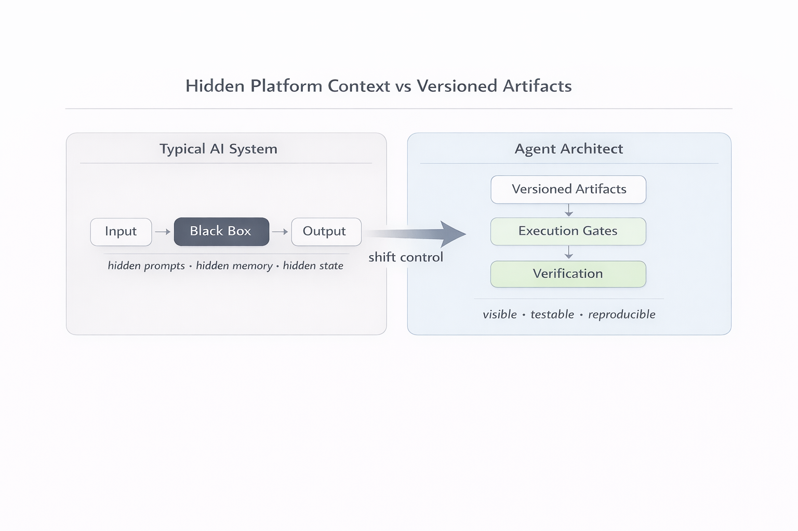
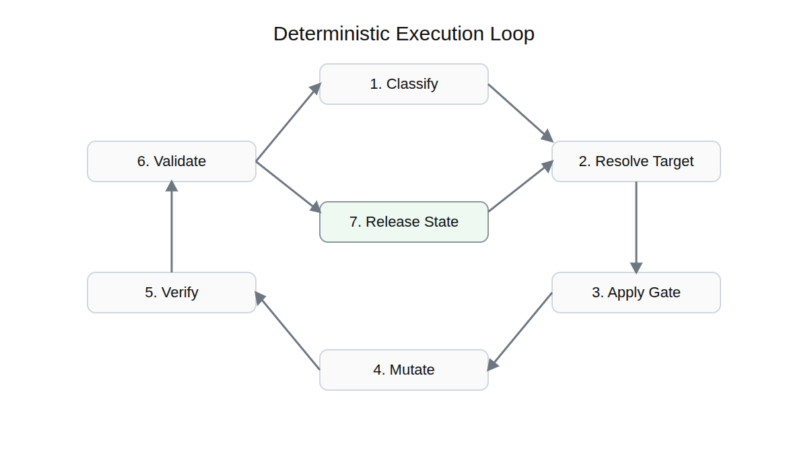

# Agent Architect

<picture>
	<source media="(prefers-color-scheme: dark)" srcset="docs/images/logos/logo.white.transparent.png">
	<source media="(prefers-color-scheme: light)" srcset="docs/images/logos/logo.transparent.png">
	
</picture>

Agent Architect is not another general AI coding assistant.

It is a VS Code extension and repo-local workflow for shifting important control away from hidden platform context and into visible artifacts, execution gates, and verification.

This repo should currently be read as an evidence-first technical review package for that approach, not as a broad maturity claim or a finished general framework.

> Current status: real and inspectable, but still bounded. There is meaningful working evidence today, but not full release-readiness, cross-surface equivalence, or cross-platform parity.

## What This Is

- a VS Code extension plus a repo-local way of working
- a system for making important AI instructions and checks live in versioned repo files instead of only in chat history
- a workflow that expects explicit checking after change, not just a fluent answer
- an attempt to make resets, handoffs, and model changes less dependent on hidden memory

## What This Is Not

- not another general AI coding assistant like Copilot, JetBrains AI, or GitLab Duo
- not a claim that AI coding is now solved
- not a broad platform where every surface is equally proven
- not the right tool when a normal assistant already gives you enough confidence

## When To Care

Use Agent Architect when:

- an unclear AI-generated change would be costly
- you keep restating the same constraints before each task
- you need to inspect why a change happened, not only what changed
- you want resets, handoffs, or model changes to trigger explicit re-checking

If a normal AI assistant is already good enough for the job, you probably do not need this.

## Why This Matters In One Minute

If the repo still feels abstract, use this shorter framing:

- normal AI workflows are often fast, but the state that guided the result is hard to inspect later
- that becomes expensive when the change is risky, the context is long-lived, or the reasoning must survive resets and handoffs
- Agent Architect is the narrower workflow for that situation: move more of the important control into repo artifacts, then require verification after the write

## Practical Value

The practical idea is simple.

Instead of repeatedly telling an assistant "only change this file, preserve this rule, and rerun this check", Agent Architect tries to move that control into repo files and then require verification after the write.

In practical terms, it helps you:

- keep important instructions in inspectable repo state
- force work through an explicit go or no-go gate
- re-check what was written instead of trusting the answer
- preserve evidence of what is proven and what is still uncertain
- make later review and handoff easier

The larger aim is deterministic re-grounding: the same visible artifacts and the same verification path should tend to recover the same practical understanding, even after reset or compact.


This is the recovery loop for regaining the right practical understanding after reset or drift. It is distinct from the execution loop shown later, which describes how a bounded piece of work should proceed once the system is properly grounded.

The first shift the repo is trying to make looks like this:



## What Is Verified Today

These are bounded claims tied to current repo evidence.

- the repo is locally buildable and testable as a VS Code extension package
- the documented baseline check is `npm install` then `npm run test`
- several runtime roles have bounded verification behind them
- one reviewer-facing proof pack exists as preserved evidence showing that `agent-architect` can create one clean explicit target and block honestly on an ambiguous prompt
- the current evidence can be inspected directly through the status page, support artifacts, and preserved benchmark evidence

## Windows Review Boundary Today

If you only need the short Windows-first review boundary, use this:

- proven on the current Windows host: the documented local baseline passes, the documented main-host extension route is evidenced, and the ordinary Local surface still supports exact reveal while ordinary exact send remains unsupported
- not proven on the current Windows host: broad Local exact-send support, verified Local custom-agent participation, cross-surface equivalence, or cross-platform parity
- the current public-review question is therefore not whether every surface is solved, but whether the repo states that bounded evidence honestly and legibly

## What Is Not Yet Proven

- full release readiness
- full helper-orchestration proof
- equal proof across Local, MCP, CLI, and Copilot CLI surfaces
- equal host parity across Linux, Windows, and macOS

## Fast Peer-Review Path

Treat this as the canonical public-review entrypoint for the current checkout.

If you want the quickest honest reviewer path:

1. Read [docs/reference/current-status.md](docs/reference/current-status.md) for the current claim boundary.
2. Run the local baseline check from the repo root:

```bash
npm install
npm run test
```

3. Expect the baseline to end with `Tests passed.`
4. Read [docs/benchmarks/agent-architect-flagship-reliability-workflow.md](docs/benchmarks/agent-architect-flagship-reliability-workflow.md), starting at `First Reviewer-Facing PoC`.
5. Use [PEER-REVIEW.md](PEER-REVIEW.md) if you want the explicit reviewer packet, questions, and scope limits.

If that already gives you enough context to comment on clarity, honesty, and scope, you do not need to read the deeper docs first.

The local baseline check is not the same thing as reproducing the reviewer-facing proof pack. It only verifies that the current checkout builds and passes the documented test baseline.

If you only have a normal checkout and no access to the internal reviewer route `runSubagent`, treat the flagship benchmark as preserved evidence to inspect, not as a guaranteed public rerun recipe. That does not block a useful public technical review today; it means the review should judge whether the repo makes its proof boundary, evidence quality, and remaining limits legible and honest.

## A Simple Mental Model

At a high level, Agent Architect tries to make AI-assisted work pass through a visible loop:

1. resolve the exact target
2. decide whether work may proceed
3. make the smallest valid change
4. verify what was written
5. validate what that result actually proves
6. report a bounded status instead of a vague success story



If you prefer the shortest framing, it is this:

- typical AI workflows depend heavily on hidden prompts, hidden memory, and hidden state
- Agent Architect tries to shift useful control toward versioned artifacts, execution gates, and validation evidence
- the point is not identical wording across chats, but sufficiently equivalent inference from visible state

## A Concrete Example

Suppose you keep repeating some version of this before every task:

- only change the intended target file
- preserve one awkward legacy rule
- rerun one bounded check after the edit
- say what is still uncertain instead of sounding certain

Without a stronger process, that intent often lives in chat history, saved prompts, PR text, or scratch notes.

Agent Architect tries to turn the same task into a tighter loop:

1. the recurring control moves into repo artifacts
2. the change goes through an explicit gate
3. the written state is checked after the write
4. the result is reported with an honest status instead of only a confident answer

> Don't be Brave. Be verifiable.

## Governance, In Practical Terms

In this repo, governance does not mean committee process or abstract AI policy language.

It means the control layer around agent work:

- what exact target must be resolved before work starts
- what execution gate decides whether the system should create, patch, repair, or block
- what must be verified after a write instead of being trusted implicitly
- what validation evidence is required before a claim becomes trustworthy
- what bounded release state the system is allowed to report at the end

In short: governance here is how the repo tries to stop hidden-context improvisation from being mistaken for justified work.

## If You Want To Go Deeper

- For the shortest status boundary, read [docs/reference/current-status.md](docs/reference/current-status.md).
- For one concrete reviewer-facing proof pack, read [docs/benchmarks/agent-architect-flagship-reliability-workflow.md](docs/benchmarks/agent-architect-flagship-reliability-workflow.md).
- For the practical local setup path, read [docs/guides/getting-started.md](docs/guides/getting-started.md).
- For the reviewer packet and review questions, read [PEER-REVIEW.md](PEER-REVIEW.md).
- For the broader concept and workflow explanation, read [docs/agent-architect.md](docs/agent-architect.md).
- For the current hardening posture and restart discipline, read [CO-DESIGNER.md](CO-DESIGNER.md) and [ROADMAP.md](ROADMAP.md).

## What To Trust

This README is the landing page, not the final authority on every claim.

For the strongest current truth, use exercised evidence and current support artifacts first, then the reference docs that describe the measured scope.

Operational anchors:

- [docs/reference/current-status.md](docs/reference/current-status.md)
- [ROADMAP.md](ROADMAP.md)
- [CO-DESIGNER.md](CO-DESIGNER.md)

Current checkout note:

- historical `.github/agents` and `.github/skills` references still exist in some benchmark and reference material
- older repo-owned runtime families are currently parked in this checkout, so do not treat those parked copies as the primary live entrypoint while re-grounding the docs
- the product mechanism of workspace agent files under `.github/agents/*.agent.md` remains supported when such files are actually present in a workspace
- for current reading, prefer support artifacts, status docs, and preserved benchmark evidence

## License And Notice

This project is distributed under the Apache License 2.0.

- [LICENSE](LICENSE)
- [NOTICE](NOTICE)

## Support The Project

Agent Architect is open, but it is not cost-free to develop.

If you want to help, the highest-value contributions are:

- testing the repo and challenging unclear claims
- improving docs, benchmarks, and validation paths
- contributing code or verification work
- helping cover ongoing tooling and token costs at Ko-Fi: https://ko-fi.com/Tiinusen

If you want the fuller version of how to help, read [SUPPORT.md](SUPPORT.md).

The notice layer matters here on purpose. It is not just legal boilerplate; it helps preserve attribution and the continuity of the vision as the project evolves.
