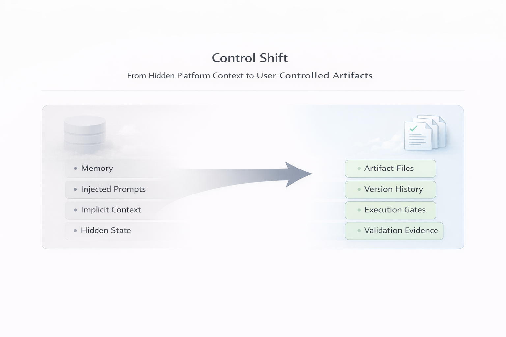

# Agent Architect

<picture>
	<source media="(prefers-color-scheme: dark)" srcset="images/logos/logo.white.transparent.png">
	<source media="(prefers-color-scheme: light)" srcset="images/logos/logo.transparent.png">
	
</picture>

Audience: technical readers who want the concrete model after first contact with the repo.

Agent Architect is a way of building AI systems so that the important parts live in artifacts you can inspect, version, and validate.

That sounds abstract until you compare it with the default experience most people have with AI tools.

You ask for something.
The model answers confidently.
Something may have changed.
Or maybe it did not.
Or maybe it worked for reasons you cannot see.

Agent Architect is an attempt to make that situation less mysterious.

If you need a short placement for the repo, treat it primarily as a reliability-and-testing-oriented workflow for repo-local agent work where hidden state and weak justification have become too costly.

The core move is a control shift:

- less dependence on hidden prompts, hidden memory, and silent platform state
- more dependence on versioned artifacts, execution gates, and validation evidence

At a glance, that shift looks like this:

The goal is not identical wording across sessions.
The goal is sufficiently equivalent inference from visible state.

This page is for a reader who wants the concrete model behind the repo.
It opens with a three-slide introduction and then continues into the fuller explanation.
After this page, the next best stop is usually [docs/reference/current-status.md](reference/current-status.md).

If this page starts to feel too dense, stop after `Three-Slide Introduction` and `What governance means here`, then continue to [docs/reference/current-status.md](reference/current-status.md).

If you already want to try the repo before reading further, jump to [docs/guides/getting-started.md](guides/getting-started.md) and run the minimal `npm install` then `npm run test` check there.
Treat that as a local baseline check, not as proof that the still-pending flagship end-to-end reliability workflow is already demonstrated.

## What this solves

In practice, this repo is trying to solve a familiar workflow problem.

You already know roughly what you want the agent to do, but too much of that intent lives in places that are easy to lose, misread, or compact away.
That often leads to more setup text, more reminders, more scratch notes, and more uncertainty about whether the resulting change was actually justified.

The point is not maximum agent breadth.
The point is a tighter proof loop around changes that would otherwise depend too heavily on memory, hidden host behavior, or trust alone.

Agent Architect tries to shift that burden toward explicit repo artifacts and explicit checks:

- repeated setup instructions become candidates for durable artifacts
- important design decisions stop living only in chat history
- file changes are expected to come with read-after-write verification
- uncertainty is meant to stay visible instead of being hidden behind confidence

Another way to say the same thing is:

- conversation can explain intent
- artifacts carry the state that should survive reset

## Three-Slide Introduction

### Slide 1: What problem does this solve?

- important design decisions and constraints often live in chat memory, scratch notes, PR text, or hidden host context
- that makes changes harder to justify, re-check, or hand off later
- the result is not only agent drift, but weak inspectability

### Slide 2: What does Agent Architect actually do?

- move recurring intent and important state into repo artifacts
- force mutation through an explicit gate instead of a vague prompt burst
- re-read changed state after the write
- report a bounded result instead of only fluent confidence
- make re-grounding depend more on visible state than on chat continuity

### Slide 3: Why not just use default or cloud agents?

- often, you should, if convenience matters more than inspectable state
- this repo is for the narrower case where resets, handoffs, or weakly justified changes are costly
- the tradeoff is more process and more artifacts in exchange for lower ambiguity and better inspection

## What to try first

If you came here from the README, read this page through `What it adds over ad hoc memory aids`, then continue to [docs/reference/current-status.md](reference/current-status.md). If you landed here directly, start with [README.md](../README.md).

If you only want the shortest useful read on this page, use this order:

1. `Three-Slide Introduction`
2. `What governance means here`
3. `The execution loop`

## When to use Agent Architect

Use Agent Architect when you already feel yourself compensating for an agent's weak memory, hidden context, or unreliable process.

Typical signs include:

- you keep restating the same design decisions before each task
- you write skill files, PR notes, prompts, or checklists just to stop the agent from forgetting what matters
- you need to know not only what changed, but why the system thinks that change is justified
- you care about repeatability enough that "it seemed to work this time" is not good enough

If that is not your situation, Agent Architect may feel heavier than necessary.

If it is your situation, Agent Architect is trying to turn those manual coping strategies into something more explicit and verifiable.

## Why not just use default or cloud agents?

The three-slide introduction above gives the short version.

Often, you should.

If convenience, speed, and platform-managed orchestration are enough for the task, a default or cloud-managed agent is usually the cheaper choice.

This repo is for the narrower situation where that convenience stops being enough.

Reach for Agent Architect when:

- the cost of an unclear or weakly justified change is high
- you want the guiding state to live in versioned repo artifacts rather than only in vendor UI context
- you need to re-check what actually guided the agent after the fact
- you want resets, handoffs, or model changes to trigger explicit re-validation rather than silent trust

The tradeoff is direct: more process, more artifacts, less magic.
That only pays off when lower ambiguity and better inspection matter more than pure convenience.

## What it adds over ad hoc memory aids

Many practical users already solve part of this problem with informal scaffolding:

- saved prompts
- skill files
- issue or PR descriptions
- scratch notes about design constraints
- repeated setup instructions before each task

Those tactics are often sensible.

What Agent Architect adds is not the discovery that memory aids help.
It is the attempt to make that discipline more systematic and more testable:

- artifacts become explicit state rather than temporary reminders
- execution gates become part of the process rather than personal habit
- read-after-write verification becomes expected rather than optional
- remaining uncertainty is reported instead of hidden behind confidence

That is also why this repo cares about deterministic re-grounding.
If the important control is really in the artifacts, a fresh session should be able to recover the right practical orientation without needing the whole old conversation replayed.

For the repo's precise meaning of skills as support artifacts rather than runtime identity, see [docs/reference/skill-system.md](reference/skill-system.md).

## What governance means here

This repo uses the word governance in a narrower and more practical way than most AI discussions do.

It does not mean a policy deck, a committee, or a vague statement that the system should be responsible.

Here, governance means the explicit control rules around agent execution:

- the target must be resolved before mutation
- the execution path must pass through the right gate
- writes must be checked with read-after-write verification
- validation must distinguish structure, process, and behavior
- the final status must stay bounded through a release state rather than collapsing into "looks good"

That is why governance in this repo is not separate from the execution model.
It is the practical layer that decides what may proceed, what must be evidenced, and what the system is justified in claiming afterward.

In plain language: governance here means the repo is trying to make agent work checkable instead of merely persuasive.

## The basic shift

Most AI systems depend on a large amount of context the user does not fully control.

That can include:

- hidden system prompts
- memory or history reuse
- platform-specific context injection
- silent state carried across turns
- host behavior that is hard to reproduce on demand

Agent Architect does not pretend those things do not exist.
Instead, it tries to move the center of gravity away from them.

The project says, in effect:

> If something matters, it should be visible enough to inspect, stable enough to version, and concrete enough to verify.

Another way to say the same thing is this:

> Confidence is cheap. Verification is truth.

That is why artifacts matter so much here.

If you want the short version, it is this:

- put the important rules in visible artifacts
- check what was written
- report what is proven and what is still uncertain

The same control shift can also be read as a move from hidden platform context toward a more visible and testable stack:

## What counts as an artifact

An artifact is not just a file for the sake of a file.
It is a durable piece of system state that can be checked later.

Examples in this repo include:

- support artifacts such as [ROADMAP.md](../ROADMAP.md) and [CO-DESIGNER.md](../CO-DESIGNER.md)
- benchmark briefs under [docs/targets](targets)
- benchmark evidence under [docs/benchmarks](benchmarks)
- reference pages that define current scope, terminology, and claim boundaries

Historical note:

- earlier runtime artifact families in this repo lived under `.github/agents/` and `.github/skills/`
- the older repo-owned copies of those families are currently parked in this checkout while the repo re-grounds its support surface and documentation
- treat the support docs and preserved benchmarks as the primary active reading surface for this checkout; do not confuse the parked repo-owned copies with the still-supported workspace runtime-agent mechanism when a workspace actually contains `.github/agents/*.agent.md`

Conversation can explain intent.
Artifacts carry state.

That distinction is one of the deepest ideas in the whole project.

One internal shorthand for the same bias is:

> Don't be Brave. Be S.M.A.R.T.
>
> Structured. Measured. Auditable. Reproducible. Tested.

## Model, capability, and artifact

Agent Architect works best when three things are kept separate.

### Artifact

Artifacts are authoritative.
They define explicit state, explicit structure, and the things that can be inspected and versioned.

### Capability

Capabilities describe what an execution path needs to be able to do.

Examples include:

- follow instructions strictly
- detect inconsistencies
- perform bounded mutation
- avoid optimistic guessing when the target is still unclear

Capabilities are requirements.
They are not proof by themselves.

### Model

The model is the implementation layer.
It executes the work, but it is not the source of truth.

That means Agent Architect should not treat model choice as hidden logic.
By default, the user-selected model remains the execution choice.
If that model appears insufficient for the capabilities the task requires, Agent Architect may recommend a different model, but it should not switch models implicitly unless the user has granted that authority.

This also means portability must be stated carefully:

- artifacts may be portable
- behavior must be re-validated per model

## The execution loop

Agent Architect tries to make work pass through a visible loop instead of a vague burst of model confidence.

The loop is:

1. classify the situation
2. resolve the exact target
3. apply the correct execution gate
4. make the smallest valid mutation
5. verify that the mutation actually happened
6. validate structure, process, and behavior
7. assign a release state

This does not guarantee model-independent behavior.
What it does is make behavior easier to inspect, re-validate, and improve when execution conditions change.

## Why this matters

Without a loop like that, AI development often becomes a fog of near-success:

- the wrong file gets changed
- the right file gets changed for the wrong reason
- the right text is produced without the intended behavior
- the model sounds certain before the repo is actually in a trustworthy state

Agent Architect is built to resist that pattern.

## Determinism comes from artifacts and validation

Agent Architect does not assume determinism comes from the model itself.

Determinism in this project comes from:

- artifact-defined state
- explicit execution gates
- read-after-write verification
- validation of behavior at the claimed scope

That is why changing model does not automatically preserve trust.
The artifact may remain portable.
The behavior still needs re-validation.

In this repo, determinism does not mean word-for-word repetition.
It means that the same visible artifacts and the same verification path should tend to recover the same practical understanding and next-step judgment.

## What this repo actually is today

This repository is not just a theory notebook.
It contains a real VS Code extension package, support artifacts, benchmark evidence, and verification helpers.

At the same time, it is not yet a finished platform with every claim settled.

The best way to understand the current status is:

- the design direction is strong
- several pieces are already real and exercised
- some surfaces are still constrained by host behavior
- Windows is the current primary truth surface for review hardening
- Linux remains the broader reference host for the strongest historical evidence, and macOS verification is still future work

For a compact host and verification snapshot, read [docs/reference/current-status.md](reference/current-status.md).

For the current restart anchor and re-grounding discipline, read [CO-DESIGNER.md](../CO-DESIGNER.md).

That balance is important.
The project is ambitious, but it is also trying not to lie about its current edge.

## The lane model

One of the more unusual strengths of this repo is that it does not treat all evidence as equally strong.

For Local chat and related host behavior, the project separates work into different lanes:

- `native-local`: strongest for user-like behavior
- `deterministic-state-hack`: strongest for repeatability and host debugging
- `transport-workaround`: useful for observability or transport questions, but weaker as proof of normal user capability

This matters because otherwise it is too easy to confuse “we found a way to make it observable” with “the normal product surface truly supports it.”

## Where to go next

After [docs/reference/current-status.md](reference/current-status.md), the most useful deeper reads are usually:

1. [docs/concepts/artifact-model.md](concepts/artifact-model.md)
2. [docs/philosophy/design-principles.md](philosophy/design-principles.md)
3. [docs/philosophy/failure-model.md](philosophy/failure-model.md)
4. [ROADMAP.md](../ROADMAP.md)
5. [CO-DESIGNER.md](../CO-DESIGNER.md)

## One sentence summary

Agent Architect is a project for turning AI work from a hidden-context performance into a system that can be inspected, challenged, and improved through artifacts, gates, and evidence.