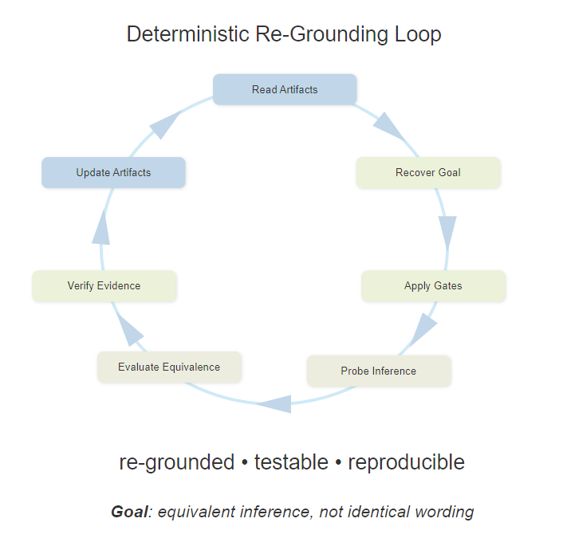

# Artifact Model

Agent Architect treats artifacts as the primary source of truth.

This is not a style preference.
It is a control strategy.

If you only want the short version, read `Why artifacts matter`, `Conversation vs artifact`, and `Deterministic re-grounding`.

## Why artifacts matter

In many AI workflows, the most important state is invisible.
The platform remembers things.
The model carries context forward.
The host injects information.
And the user has only a partial view of why a result happened.

An artifact-first model pushes back on that.

It says:

- if state matters, write it down
- if a claim matters, anchor it in something inspectable
- if a change matters, verify it against the artifact itself

## Artifact families in this repo

The repo uses several artifact families for different jobs.

### Runtime artifacts

These are the closest thing to active system definition when a live runtime family is present.

Examples:

- workspace runtime-agent files under `.github/agents/*.agent.md` when a workspace actually contains them
- historical repo-owned runtime artifacts now parked under [../parked/github-autoload-history/agents](../parked/github-autoload-history/agents)

Important distinction:

- parked repo-owned runtime artifacts in this checkout are lineage, not current repo authority
- the workspace runtime-agent mechanism remains a supported product path when those files are actually present in a workspace

When live runtime artifacts are present, they define runtime roles and operating contracts.

### Support artifacts

These explain process, design intent, boundaries, and active hardening work.

Examples:

- [README.md](../../README.md)
- [ROADMAP.md](../../ROADMAP.md)
- [CO-DESIGNER.md](../../CO-DESIGNER.md)

These matter, but they do not automatically outrank runtime evidence.

### Benchmark and validation artifacts

These capture what is being tested and what evidence was preserved.

Examples:

- [docs/targets](../targets)
- [docs/benchmarks](../benchmarks)

### Companion artifacts

These are support-only development artifacts for runtime agents.
They are not the default and they are not meant to become hidden runtime dependencies.

In the current checkout, the repo-owned companion examples also live in parked historical material.

## Conversation vs artifact

Conversation is useful for:

- intent
- clarification
- planning
- discussion

Artifacts are needed for:

- state
- mutation proof
- validation evidence
- recovery after reset or drift

That is why the repo repeatedly insists that conversation cannot replace artifact state.

## What this gives you

An artifact-first approach does not remove uncertainty.
What it does is make uncertainty visible.

You can see:

- what the target was
- what changed
- what was verified
- what still needs proof

That is a much healthier place to build from than confident output floating on hidden context.

## Deterministic re-grounding

In this repo, the deeper goal is not identical wording after reset.
It is that visible artifacts and visible verification paths should recover sufficiently equivalent inference.

That loop is meant to work like this:

That is why support artifacts such as [CO-DESIGNER.md](../../CO-DESIGNER.md) matter so much alongside runtime code and preserved evidence.

In plain language: the project wants a later reader to recover the same practical understanding from the artifacts, even if the exact wording changes.